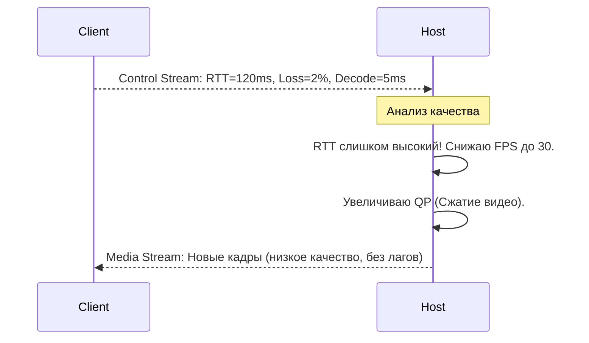

# LuminaRemote: Архитектура

Данный документ описывает модульную архитектуру проекта LuminaRemote, назначение компонентов и то, как они взаимодействуют друг с другом.

## 1. Обзор Компонентов и Контекст (C4 Model)

LuminaRemote работает как гибридное P2P приложение. Все Rust компоненты объединены в один Cargo workspace.

```mermaid
graph TD
    subgraph Client UI ["UI Слой (React / Vue)"]
        A(Графический интерфейс пользователя)
    end
    
    subgraph Tauri Backend ["Tauri Обвязка (src-tauri)"]
        B(Связующий IPC слой)
    end
    
    subgraph Rust Crates ["Ядро приложения (Rust)"]
        Core[lumina-core]
        Proto[lumina-protocol]
        Net[lumina-network]
        Capture[lumina-capture]
        Encode[lumina-encoder]
        Input[lumina-input]
    end
    
    subgraph External Infra ["Инфраструктура"]
        SigServer(Lumina Signal Server)
        Relay(Lumina Relay Server)
    end
    
    A <-->|Tauri IPC| B
    B --> Core
    B --> Net
    B --> Capture
    B --> Encode
    B --> Input
    
    Net <-->|WebSocket| SigServer
    Net <-->|QUIC| Relay
    Net <-->|QUIC (P2P)| Net
```

---

## 2. Описание Модулей (Crates)

### 2.1. `lumina-core`
Базовый модуль без побочных эффектов.
- **Ответственность:** Базовые типы, конфигурации, утилиты логирования.
- **Безопасность:** Реализует криптографические примитивы. Генерация приватных и публичных ключей `X25519` из 12-символьной сид-фразы при помощи `Argon2id` и `HKDF`.

### 2.2. `lumina-protocol`
Модуль сетевого общения.
- **Ответственность:** Определяет структуры данных, которые пересылаются по сети.
- **Функции:** Сериализация и десериализация кадров (Video Frames), команд ввода (Mouse/Key Events), сигнальных сообщений (Signal Server Messages).

### 2.3. `lumina-network`
Сетевое ядро приложения.
- **Ответственность:** Управление QUIC-соединениями (`quinn`).
- **Слои:**
  - **LAN (mDNS):** Поиск локальных инстансов (без выхода в интернет).
  - **WAN (NAT Traversal):** Использование STUN для hole punching.
  - **Fallback:** Если пробить NAT не удалось, инициализация прокси-соединения через Relay сервер.
- **Транспорт:** QUIC разделяет Control streams (ввод, команды) и Media streams (видео-байты).

### 2.4. `lumina-capture`
Модуль захвата экрана.
- **Ответственность:** Агностик захват экрана, курсора и аудио.
- **Бэкенды:** DirectX Desktop Duplication (Windows), CGWindowList (macOS), X11/PipeWire (Linux).

### 2.5. `lumina-encoder`
Обертка над аппаратными кодировщиками.
- **Ответственность:** Конвертация сырых BGRA кадров в H.264/AV1 поток.
- **Инструментарий:** FFmpeg (`ffmpeg-sys-next`) или напрямую API драйверов (NVENC, AMF, QuickSync) для нулевой задержки.

### 2.6. `lumina-input`
Модуль эмуляции ввода.
- **Ответственность:** Инъекция нажатий клавиш и движений мыши на стороне Хоста.

### 2.7. `lumina-signal-server`
Внешний сервис (Actor-модель на Tokio).
- **Ответственность:** Помогает клиентам обменяться публичными ключами и публичными IP/портами перед началом прямого общения. Не участвует в передаче видео-трафика.

---

## 3. Процесс Установления Безопасного Соединения

LuminaRemote использует модель **Zero-Trust**. Пароли не хранятся и не передаются в открытом или хешированном виде. Для соединения используется 12-символьный код, вводимый пользователем.

```mermaid
sequenceDiagram
    participant Host
    participant Signal as Signal Server
    participant Client
    
    Note over Host: Шаг 1: Генерация на Хосте
    Host->>Host: Генерирует Random Seed (12 символов)
    Host->>Host: Argon2(Seed) -> MasterKey
    Host->>Host: MasterKey -> Вычисляет (PubKey_H, PrivKey_H)
    Host->>Signal: Регистрация (Мой PubKey_H, Мой WAN_IP)
    
    Note over Client: Пользователь диктует 12 символов Клиенту
    
    Note over Client: Шаг 2: Ввод на Клиенте
    Client->>Client: Argon2(Seed) -> MasterKey
    Client->>Client: MasterKey -> Вычисляет (PubKey_C, PrivKey_C)
    
    Client->>Signal: Хочу подключиться к PubKey_H. Мой ключ PubKey_C.
    Signal-->>Client: Отдает IP/Порт Хоста (Кандидаты)
    Signal-->>Host: Уведомляет: К вам пытается подключиться PubKey_C
    
    Note over Host, Client: Шаг 3: QUIC Соединение
    Client->>Host: Начинает QUIC Handshake
    
    Note over Host, Client: Шаг 4: Diffie-Hellman Key Exchange (ECDH)
    Host->>Host: ECDH(Мой PrivKey_H, Чужой PubKey_C) -> SharedSecret
    Client->>Client: ECDH(Мой PrivKey_C, Чужой PubKey_H) -> SharedSecret
    
    Note over Host, Client: SharedSecret абсолютно идентичен у обоих
    
    Host<-->>Client: TLS 1.3: Аутентификация пройдена (PSK = SharedSecret)
```

---

## 4. Видео-конвейер (Media Pipeline)

Для минимизации задержек приложение не отправляет все пиксели экрана 60 раз в секунду. Процесс оптимизирован:

```mermaid
graph LR
    A[Capture: Сделать снимок] --> B{Есть изменения?}
    B -- Нет --> F[Ждать следующий кадр]
    B -- Да --> C[Вычислить 'Dirty Rects' (измененные области)]
    C --> D[Encoder: Аппаратное кодирование H.264]
    D --> E[Protocol: Упаковать во фрейм с ID и Меткой времени]
    E --> Net[Network: Отправить по QUIC Media Stream]
```

## 5. Адаптивный Битрейт (Adaptive QoS)

Так как мобильные сети могут терять пакеты, `lumina-network` постоянно собирает статистику и отправляет на хост пакеты обратной связи:


