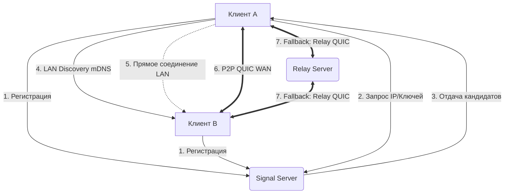

# LuminaRemote: Техническая спецификация

**Версия:** 1.0.0-draft
**Статус:** Ready for Development
**Концепция:** Ультрабыстрый, легковесный и безопасный удаленный доступ, оптимизированный для нестабильных сетей и локальных подключений.

---

## 1. Архитектурный обзор

LuminaRemote использует гибридную P2P-архитектуру. Приложение состоит из трех основных компонентов:
1. **Lumina Client (Клиент/Хост)** — кроссплатформенное приложение на Rust.
2. **Lumina Signal Server** — сервер инициализации и маршрутизации (Rust).
3. **Lumina Relay Server** — TURN-сервер для проброса трафика при строгих NAT (Rust).

### Сетевая модель взаимодействия


---

## 2. Технологический стек

### Ядро (Core)
* **Язык:** Rust (Edition 2021, стабильный канал).
* **Асинхронность:** `tokio` (многопоточность, I/O).
* **Сеть (Транспорт):** `quinn` (Реализация QUIC протокола). QUIC выбран вместо сырого UDP/TCP так как обеспечивает:
  * Отсутствие блокировки заголовка (Head-of-line blocking).
  * Встроенное шифрование (TLS 1.3).
  * Быстрое установление соединения (0-RTT/1-RTT).
  * Адаптацию к потерям пакетов (важно для мобильного интернета).

### Безопасность (Security)
* **Криптография:** `x25519-dalek` (Эллиптические кривые), `hkdf` (Derivation), `chacha20poly1305` (Шифрование payloads, если требуется слой поверх QUIC, хотя QUIC уже зашифрован), `blake3` (Хеширование).
* **Генерация из сид-фразы:** `argon2` (ForKey Derivation Function).

### Мультимедиа и захват экрана (Media Pipeline)
* **Захват экрана (Windows):** `windows-capture` (DirectX Desktop Duplication API — самый быстрый метод).
* **Захват экрана (macOS):** `core-graphics` (CGWindowListCreateImage).
* **Захват экрана (Linux):** `x11cap` (X11) / `pipewire` (Wayland).
* **Кодирование видео:** Аппаратное кодирование через FFmpeg (`ffmpeg-sys-next`) с использованием видеокарт (NVENC, VideoToolbox, VAAPI). Кодек: **H.264 (Baseline/Low Latency Profile)** или **AV1** (если поддерживается железом).
* **Ввод (Клавиатура/Мышь):** `enigo` (кроссплатформенная инъекция ввода).

## 6. Графический интерфейс (Фаза 4)
- Будет реализован на базе **Tauri** (React/TypeScript). Выбрано для создания современного и красивого UI.
- **Дизайн:** Современный молодежный стиль (Dark Mode, неон, размытия/стекло, скругления).
- **Поведение окна:** Большое окно дашборда. При закрытии на крестик окно сворачивается в системный трей (фоновый режим для сервера).
- **Список устройств ("Мои машины"):** Отображается в виде карточек с картинкой/предпросмотром рабочего стола для Unattended Access.
- **Мобильная версия:** Планируется в будущем. Rust-ядро будет переиспользовано.

---

## 3. Сетевой протокол: Lumina Protocol (LP)

Транспортный уровень QUIC делится на два типа стримов:
* **Control Stream (Бидирекциональный):** События ввода (мышь, клава), подтверждения, пинги, метрики.
* **Media Stream (Унидирекциональный):** Потоковое видео и аудио.

### Формат кадра видео (Video Frame Format)
Для минимизации задержек применяется "пользовательский" контейнер внутри QUIC stream:
```rust
#[repr(C, packed)]
struct LuminaFrameHeader {
    frame_id: u32,        // Порядковый номер
    flags: u8,            // 0b00000001 -> Keyframe, 0b00000010 -> Contains Cursor
    width: u16,           // Может меняться при динамическом изменении разрешения
    height: u16,
    region_count: u8,     // Количество измененных регионов (Dirty Rects)
    timestamp_us: u64,    // Микросекунды для синхронизации
}
// Далее следуют регионы: [x, y, w, h, data_size, data...]
```

### Адаптация к плохому интернету (Adaptive Bitrate)
Каждые 500 мс Клиент отправляет пакет с метриками на Хост:
```rust
struct NetworkFeedback {
    rtt_ms: u16,
    packets_lost: u16,
    jitter_ms: u16,
    decode_time_ms: u16,
}
```
На основе этого Хост динамически меняет:
1. **FPS** (60 -> 30 -> 15).
2. **Разрешение** (100% -> 75% -> 50%).
3. **Качество кодека (CRF/QP)**.
4. **Включает/выключает аппаратное декодирование на клиенте.**

---

## 4. Модель безопасности и аутентификации

Безопасность реализована по принципу Zero-Trust. Даже при LAN-подключении трафик зашифрован.

### 4.1. Беспарольный доступ по 12-символьному ключу (Unattended Access)

Это уникальная фича LuminaRemote, исключающая передачу паролей.

**Алфавит ключа:** `23456789ABCDEFGHJKLMNPQRSTUVWXYZ` (Исключены 0, O, 1, I, L во избежание ошибок чтения). 12 символов дают ~70 бит энтропии.

**Процесс настройки (Key Pairing):**
1. На Хосте генерируется случайный Seed из 12 символов алфавита.
2. Пользователь на Хосте передает эти 12 символов пользователю Клиента.
3. **На Клиенте:** Seed пропускается через `Argon2id` (высокая стоимость памяти и времени, чтобы защитить от брутфорса сид-фразы) -> получается 32-байтовый мастер-ключ.
4. Из мастер-ключа через `HKDF` (Blake3) генерируется **X25519 Private Key**.
5. Вычисляется **X25519 Public Key**.
6. Public Key отправляется на Signal Server как идентификатор устройства.

**Процесс подключения:**
1. Клиент вводит 12 символов. Вычисляет свой X25519 Private/Public Key.
2. Через Signal Server Клиент запрашивает Public Key Хоста.
3. Клиент и Хост выполняют X25519 ECDH (Diffie-Hellman) -> получают Shared Secret.
4. Из Shared Secret выводится ключ шифрования сессии.
5. Устанавливается QUIC соединение. TLS 1.3 внутри QUIC использует Pre-Shared Key (PSK), выведенный из нашего Shared Secret. *Это гарантирует 0-RTT handshake и полную защиту от MITM.*

### 4.2. Интерактивный доступ (Запрос подтверждения)
Используется стандартный X25519 обмен ключами через Signal Server (с проверкой отпечатков пальцев опционально). При подключении Хост показывает системное окно: "Пользователь X запрашивает доступ [Разрешить] [Отклонить]". До нажатия "Разрешить" видеопоток не начинается, передается только экран блокировки (опционально).

---

## 5. Локальная сеть (LAN) vs Глобальная сеть (WAN)

### Алгоритм подключения (Connection Logic)
При запуске клиентское приложение делает следующее:
1. Подключается к Signal Server по WSS (TCP) для получения WAN IP и статуса.
2. Запускает mDNS broadcaster/listener в фоновом потоке.
3. Когда пользователь выбирает устройство в списке (или вводит ID), Клиент проверяет:
   * **Шаг А:** Есть ли устройство в локальной mDNS кэш-таблице?
   * **Шаг Б:** Если да, отправляем пробный QUIC пакет на локальный IP (порт 21589). Если ответ пришел за < 10мс — подключаемся напрямую через LAN.
   * **Шаг В:** Если нет ответа (разные подсети, заблокирован мультикаст), запрашиваем у Signal Server WAN IP и кандидаты на NATTraversal (STUN). Пытаемся пробить NAT.
   * **Шаг Г:** Если пробить NAT не удалось (Symmetric NAT), переключаемся на Relay Server.

*Важно:* Безопасность в LAN обеспечивается точно так же, как и в WAN (через X25519). mDNS передает только имя хоста и локальный IP, шифрование происходит на уровне QUIC.

---

## 6. Структура проекта (Workspace)

```text
luminaremote/
├── Cargo.toml                 # Workspace root
├── crates/
│   ├── lumina-core/           # Базовые типы, конфиги, криптография (X25519, Argon2)
│   ├── lumina-protocol/       # Сериализация/Десериализация кадров, сетевые пакеты
│   ├── lumina-network/        # QUIC клиент/сервер, mDNS, NAT traversal
│   ├── lumina-capture/        # Абстракция над захватом экрана (Windows/Mac/Linux)
│   ├── lumina-encoder/        # Обертка над FFmpeg/HW encoders
│   ├── lumina-input/          # Перехват и эмуляция мыши/клавиатуры
│   └── lumina-signal-server/  # Сервер сигнализации (Actor model на tokio)
├── src-tauri/                 # Tauri приложение (обвязка над crate-ами для GUI)
└── ui/                       # Фронтенд на React/Vue
```

---

## 7. План разработки и релиза (Roadmap)

### Фаза 1: Proof of Concept (PoC) — 4 недели
*Цель: Доказать, что архитектура держит заявленную задержку.*
- [ ] Настроить `quinn` (QUIC), реализовать отправку сырых фреймов между двумя localhost процессами.
- [ ] Написать захват экрана на Windows (Desktop Duplication) и кодирование в H.264 через FFmpeg.
- [ ] Написать декодер и рендеринг в окне (через `winit` + `softbuffer` или `egui` для тестов).
- [ ] Замерить задержку (цель: < 50 мс в локалке).
- [ ] Реализовать инъекцию мыши и клавиатуры.

### Фаза 2: Сетевой слой и Безопасность — 4 недели
*Цель: Полноценное P2P подключение.*
- [ ] Реализовать Signal Server (база данных in-memory + Redis, REST API).
- [ ] Реализовать механизм X25519 с 12-символьным seed (Argon2id).
- [ ] Интегрировать PSK (Pre-Shared Key) в QUIC `quinn`.
- [ ] Реализовать NAT Traversal (STUN).
- [ ] Написать базовый Relay сервер (проксирование QUIC).

### Фаза 3: LAN и Адаптивность — 3 недели
*Цель: Работать везде и всегда.*
- [ ] Внедрить mDNS обнаружение.
- [ ] Написать алгоритм Adaptive Bitrate (изменение QP и FPS на лету).
- [ ] Оптимизация "грязных прямоугольников" (Dirty Rects) — отправлять только измененные части экрана.
- [ ] Обработка потери фокуса (пауза захвата, чтобы не жрать CPU/GPU).

### Фаза 4: GUI и Кроссплатформенность — 5 недель
*Цель: Коммерческий вид.*
- [ ] Сборка Tauri приложения.
- [ ] Верстка UI: Список устройств (LAN сверху, Online снизу), панель инструментов (Ctrl+Alt+Del, отправка файлов, настройки).
- [ ] Порт захвата экрана на macOS (ScreenCaptureKit) и Linux (X11/Wayland).
- [ ] Системная интеграция (трей, автозапуск, установка служб для elevation прав на Linux/Windows).

### Фаза 5: Релиз (Release Candidate) — 2 недели
- [ ] Обфускация бинарников (UPX для уменьшения размера, хотя Rust уже маленький).
- [ ] Автосборка (GitHub Actions) для Windows, macOS, Linux.
- [ ] Penetration Testing криптографии (аудит генерации из 12 символов).
- [ ] Подготовка инсталляторов и релиз.

---

## 8. Критические риски и их митигация

| Риск | Вероятность | Решение |
| :--- | :---: | :--- |
| **Задержка на плохом мобильном интернете** | Высокая | Использование QUIC (отказ от TCP), агрессивный дроп FPS до 15, сильное сжатие (высокий QP), запрет B-фреймов в H.264. |
| **Проблемы с захватом на Wayland/Linux** | Высокая | Использование PipeWire и XDG Desktop Portal. Падение обратно на X11, если Wayland недоступен. |
| **Brute-force 12-символьного ключа** | Средняя | Использование `Argon2id` с параметрами `m=64MB, t=3, p=2`. Одна попытка заняет ~0.1 сек на CPU. 70 бит энтропии защитят от онлайн-брутфорса, а оффлайн брутфорс сид-фразы будет стоить месяцев вычислений на GPU. |
| **Высокая нагрузка на CPU/GPU у Хоста** | Средняя | Аппаратное кодирование *обязательно*. Если GPU занято на 100% (например, игра), переключаемся на софтверный кодек с низким разрешением или ставим захват на паузу. |

---

## 9. Быстрый старт для разработчика

Для немедленного старта разработки выполните:

```bash
# Клонирование шаблона
cargo new luminaremote --workspace
cd luminaremote

# Добавление критичных зависимостей в Cargo.toml
# [dependencies]
# tokio = { version = "1.32", features = ["full"] }
# quinn = "0.10"
# rustls = { version = "0.21", features = ["dangerous_configuration"] } # Для кастомного PSK
# x25519-dalek = { version = "2.0", features = ["static_secrets"] }
# argon2 = "0.5"
# ffmpeg-sys-next = "6.0"
# mdns = "3.0"

# Создание структуры
mkdir -p crates/lumina-core/src
mkdir -p crates/lumina-network/src
mkdir -p crates/lumina-capture/src
# ... и т.д.
```

**Первичная задача (First Task):** Написать функцию `derive_key_pair(seed: &str) -> (StaticSecret, PublicKey)` в `lumina-core`, интегрировать её в `quinn::ServerConfig` как `rustls::CustomCertVerifier` / PSK и добиться того, чтобы два QUIC-сокета смогли обменяться данными, используя только 12-символьную строку без сертификатов УЦ.
